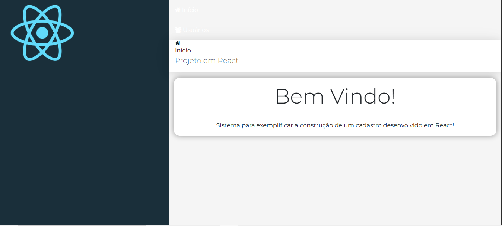

<h2 id="sobre-o-projeto">1. React CRUD: Sistema de Cadastro de Usuários ⚛️</h2>


[](https://github.com/Domisnnet/Frontend-React/blob/main/LICENSE)



Bem-vindo ao **React CRUD**! Este é um projeto full-stack (frontend) que simula um sistema completo de gerenciamento de usuários. Utilizando uma arquitetura baseada em componentes funcionais e o poder do **React**, a aplicação oferece uma interface administrativa moderna e responsiva. O projeto foca em padrões de design escaláveis, separando claramente as responsabilidades entre navegação, cabeçalho, conteúdo e rodapé.

---

## 📚 Tabela de Conteúdo

| ⚛️ O Projeto | 🛠️ Técnico | 🤝 Comunidade |
| :---: | :---: | :---: |
| [](#sobre-o-projeto) | [](#destaques-tecnicos) | [](#codigo-fonte) |
| [](#tecnologias-utilizadas) | [](#instalacao) | [](#créditos) |
| [](#como-acessar) | [](#como-contribuir) | [](#licenca) |
| [](#funcionalidades) | [](#faq) | [](#perfil-do-github) |

---

<h2 id="tecnologias-utilizadas">2. ⚙️ Tecnologias Utilizadas</h2>

| Camada | Tecnologias | Descrição |
| :--- | :--- | :--- |
| **Framework** |  | Desenvolvimento baseado em componentes reutilizáveis. |
| **Estilo UI** |  | Grid system e estilização ágil de formulários e tabelas. |
| **Iconografia** |  | Ícones vetoriais para ações de editar, excluir e navegar. |
| **Layout** |  | Estruturação da aplicação através de `grid-template-areas`. |

---

<h2 id="como-acessar">3. 🚀 Como Acessar</h2>

Experimente a interface do sistema administrativo agora mesmo:

<div align="left">
  <a href="https://github.com/Domisnnet/Frontend-React/" target="_blank">
    
  </a>
</div>

---

<h2 id="funcionalidades">4. 🧩 Funcionalidades Principais</h2>

O sistema foi desenhado para operações de alta produtividade:

| Funcionalidade | Descrição |
| :--- | :--- |
| 📝 **Cadastro de Usuários** | Formulário intuitivo para inserção de novos registros. |
| 🔍 **Listagem Dinâmica** | Visualização de dados em tabelas formatadas com Bootstrap. |
| 🛠️ **Edição em Tempo Real** | Atualização de informações de usuários já cadastrados. |
| 🗑️ **Exclusão Segura** | Remoção de registros com interface simplificada. |
| 🧭 **Navegação SPA** | Transição entre Home e Usuários sem recarregamento de página. |

---

<h2 id="destaques-tecnicos">5. 💻 Destaques Técnicos</h2>

Este projeto aplica conceitos de arquitetura de software front-end moderna:

### 📐 CSS Grid & Template Areas
A aplicação utiliza um layout avançado onde as áreas são nomeadas (`logo`, `header`, `menu`, `content`, `footer`). Isso permite uma manutenção visual extremamente simples e uma organização de código impecável.

### 🔄 Componentização React
Cada parte da interface (Nav, Logo, Footer) é um componente independente que recebe propriedades (`props`). Isso facilita o reuso de código e a escalabilidade do sistema para novas funcionalidades.

---

<h2 id="instalacao">6. 🚀 Instalação e Configuração Local</h2>

```bash
# Clonar o repositório
git clone https://github.com/Domisnnet/Frontend-React.git(https://github.com/Domisnnet/Frontend-React.git)

# Acessar a pasta
cd Frontend-React
```
---

<h2 id="como-contribuir">7. 🤝 Como Contribuir</h2>

Siga os passos abaixo para evoluir este CRUD:

| Fase | Ação | Link / Comando |
| :---: | :--- | :--- |
| **01** | **Fork** | [](https://github.com/Domisnnet/Frontend-React/fork) |
| **02** | **Branch** | `git checkout -b feature/ValidacaoCampos` |
| **03** | **Commit** | `git commit -m 'feat: adição de validação de e-mail'` |
| **04** | **Push** | `git push origin feature/ValidacaoCampos` |
| **05** | **PR** | [](https://github.com/Domisnnet/Frontend-React/compare) 

### 🐛 Encontrou um problema?
Se algo não estiver funcionando como esperado, não hesite em abrir um chamado:

[](https://github.com/Domisnnet/Frontend-React/issues)
[](https://github.com/Domisnnet/Frontend-React/issues/new)

---

<h2 id="faq">8. 🧠 Perguntas Frequentes</h2>

<details>
<summary><strong>Onde os dados são salvos ❓</strong></summary>
<p>💾 <strong>Resposta:</strong> Como se trata de um projeto front-end de estudo, em uma versão completa ele se conectaria a uma API (como JSON Server ou Node.js) para persistência em banco de dados.</p>
</details>

<details>
<summary><strong>Como o Bootstrap é integrado ao React ❓</strong></summary>
<p>🎨 <strong>Resposta:</strong> Utilizamos a importação direta do CSS do Bootstrap no arquivo principal, permitindo o uso de classes nativas diretamente nas tags JSX.</p>
</details>

---

<h2 id="codigo-fonte">9. 💻 Código Fonte</h2>

Analise a lógica de renderização e os estilos globais:

[](https://github.com/Domisnnet/Frontend-React/tree/main/src)
---

<h2 id="créditos">10. 📝 Créditos & Reconhecimentos</h2>

O React CRUD é o resultado de estudos sobre o ecossistema de componentes:

| Atribuição | Responsável / Recurso | Descrição |
| :--- | :--- | :--- |
| **Dev Front-end** | **DomisDev** | Implementação de componentes, lógica de estado e Grid Layout. |
| **Design System** | **Bootstrap** | Fornecimento de componentes visuais e responsividade. |
| **Educação** | **Cod3r Cursos** | Base técnica para estruturação do projeto CRUD em React. |
| **Apoio Técnico** | **Google Gemini** | Padronização e refinamento documental. |

---

<h2 id="licenca">11. 📄 Licença</h2>

Este projeto está licenciado sob a [](https://github.com/Domisnnet/Frontend-React/blob/main/LICENSE)

---

<h2 id="perfil-do-github">12. 👨‍💻 Perfil do GitHub</h2>

<a href="https://github.com/Domisnnet"> 
   
</a>
